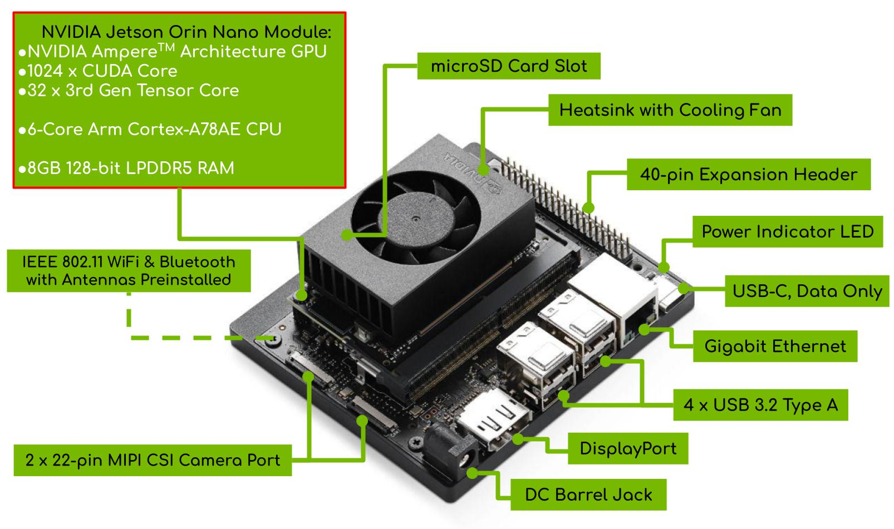
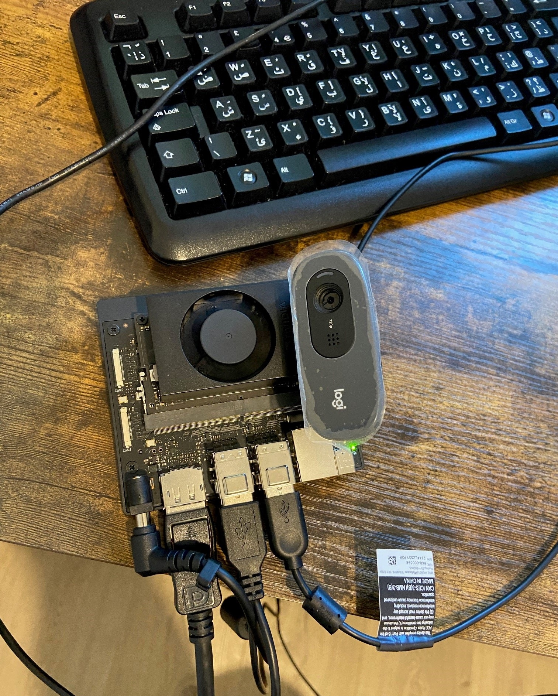
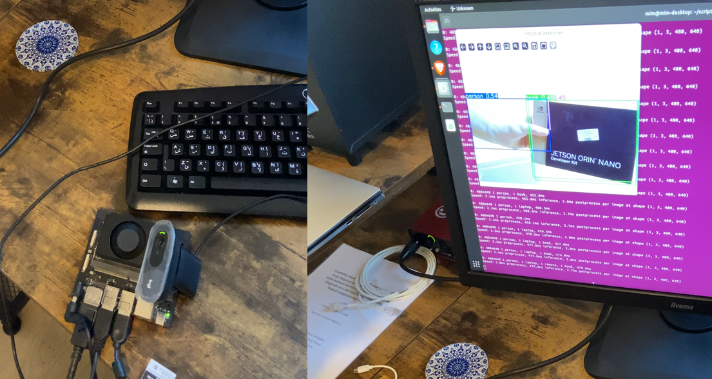

## Jetson Orin Nano tutorial, from zero to hero in one repository!


This repository is your ultimate guide to getting started with the **NVIDIA Jetson Orin Nano**. It covers both **hardware setup** and **software configuration**.
We will use 
[YOLOv11](https://github.com/ultralytics/ultralytics) to perform **object detection** with our [Jetson Orin Nano](https://developer.nvidia.com/buy-jetson).
Additionally, we will use **OpenCV** to perform **face detection** with a pre-trained Haar cascades.





# to-do:
- [ ] test with ubunto's release for NVIDIA: [Install Ubuntu on NVIDIA Jetson](https://ubuntu.com/download/nvidia-jetson).
- [ ] Implement pruning for better inference speed.

# Also see:
- My [YOLO ONNX Inference Tutorial](https://github.com/MjdMahasneh/yolo_onnx_inference_tutorial) to learn how to handle ONNX inference for corss platform applications and speeding up, or to implement custom post processing if needed.

- My repo for [custom YOLO detection](https://github.com/MjdMahasneh/custom-object-detection-with-yolov11), to learn how to collect, annotate, and build your custom object detector/pose estimator/segmontor with Ultralytics.

- My repo for [custom object tracking using YOLO features and feature matching](https://github.com/MjdMahasneh/Object_Tracking_using_YOLO_and_Feature_Matching) to learn how to improve Tracking and Re-IDing performance and speed by recycling YOLO backbone's feature for similarity analysis at object tracking stage.
  
- Ultralytics's [Nvidia Jetson](https://docs.ultralytics.com/guides/nvidia-jetson/) and [TensorRT](https://docs.ultralytics.com/integrations/tensorrt/) to learn how to run, quantize, and export your YOLO model into an RT engine for speed and better compatabiloty with you Jetson device.


# Contents
- Requirements
- Flash the SD Card for Jetson Orin
- Installing PyTorch
- Installing OpenCV
- Running a Haar cascades face detection example
- Running a YOLOv11 object detection example

---

# Requirements


## Hardware Requirements
- NVIDIA Jetson Orin (or compatible Jetson device)
- SD Card (minimum 32GB recommended)
- Power supply for the Jetson device
- Monitor, keyboard, and mouse for initial setup
- Camera module (e.g., USB camera, CSI camera) for vision tasks


Here is how the Jetson Orin Nano setup looks like:


## Software Requirements
- **JetPack SDK**: Download from [NVIDIA JetPack Downloads](https://developer.nvidia.com/embedded/jetpack)
- Development system (host PC):
  - **Windows**, **macOS**, or **Linux** for flashing and development
- **Flashing tools**: Balena Etcher or Rufus
- **Python 3.8+** (pre-installed with JetPack)
- Deep Learning frameworks:
  - **TensorFlow** or **PyTorch** (JetPack includes support for both)
- **NVIDIA** libraries (pre-installed with JetPack):
  - CUDA Toolkit
  - cuDNN
  - TensorRT
- **Additional libraries**:
  - OpenCV (pre-installed with JetPack)
  - NumPy
- **YOLOv5/YOLOv8/YOLO11**
- **Optional** (for advanced users):
  - ROS/ROS2 for robotics integration
  - Jupyter Notebook for interactive coding


---

# Flash the SD Card for Jetson Orin

## Download JetPack SDK
1. Visit [NVIDIA JetPack Downloads](https://developer.nvidia.com/embedded/jetpack).
2. Download the appropriate image for your Jetson device. In our case its **Jetson Orin Nano Developer Kit**.

## Write Image to SD Card
- Ensure the SD card has at least **32GB** of space. 
- For **Windows** users, download, install, and launch [SD Memory Card Formatter](https://www.sdcard.org/downloads/formatter/sd-memory-card-formatter-for-windows-download/).
  - Select card drive
  - Select “Quick format”
  - Leave “Volume label” blank
  - Click “Format” to start formatting, and “Yes” on the warning dialog
- Update the Firmware (if needed)
  - This step is cruical. Your Jetson Orin Nano Developer Kit may be ready to run JetPack 6 by having the latest firmware ("Jetson UEFI firmware" on QSPI-NOR flash memory) flashed at the factory. **If this isn’t the case, you’ll need to upgrade to the latest firmware by following these [steps](https://developer.nvidia.com/embedded/learn/get-started-jetson-orin-nano-devkit#firmware).** 
- Use tools like [Balena Etcher](https://etcher.balena.io/) or [Rufus](https://rufus.ie/en/) to flash the downloaded `.img` file. For this tutorial, we will use Balena Etcher to flash the image to the SD card:  
  
    - Download and Install [Balena Etcher](https://etcher.balena.io/).
    
    - Go to Balena Etcher and download for your OS (**Windows**, **Mac**, or **Linux**).
    
    - Insert your **SD** card into your computer using a card reader.
    
    - Open Balena Etcher.
   
    - Click "Flash from file" and select the .img file you downloaded.
    
    - Select your SD card as the target.
    
    - Click "Flash" to start the process.
    
    - Wait for Completion. Balena Etcher will validate the write process automatically.
    
    - Once completed, eject the SD card safely.


## Insert SD Card and Boot
1. Insert the SD card into the Jetson Orin.
2. Connect power, display, keyboard, and mouse.
3. Boot up and follow the on-screen setup instructions (WiFi, timezone, etc.).


---

# Validate cuda installation

Now that we booted up the Jetson Orin Nano, we need to validate the cuda installation.
Lets do that by running the following command:

```bash
  --version
```

If this does not work, e.g., `nvcc: command not found`,
it indicates that the system cannot locate the NVIDIA CUDA Compiler (nvcc). 
This typically happens when the CUDA Toolkit is installed (since we have installed JetPack) but its binary directory isn't included in the system's PATH.


To resolve this issue, follow the steps below:


**Verify CUDA Installation: check if the CUDA Toolkit is installed by listing its directory:**

```bash
ls /usr/local/cuda
```

If the directory exists, the toolkit is installed.

**Now we need to update Environment Variables to include the CUDA Toolkit's binary directory in the system's PATH.**

Add the CUDA binary path to your PATH environment variable and the library path to LD_LIBRARY_PATH:

```bash
export PATH=/usr/local/cuda/bin${PATH:+:${PATH}}
export LD_LIBRARY_PATH=/usr/local/cuda/lib64${LD_LIBRARY_PATH:+:${LD_LIBRARY_PATH}}
```

To make these changes permanent, append the above lines to your ~/.bashrc file (a configuration file for the Bash shell. It is executed whenever you start a new terminal):

```bash
echo 'export PATH=/usr/local/cuda/bin${PATH:+:${PATH}}' >> ~/.bashrc
echo 'export LD_LIBRARY_PATH=/usr/local/cuda/lib64${LD_LIBRARY_PATH:+:${LD_LIBRARY_PATH}}' >> ~/.bashrc
```

Reload the ~/.bashrc file to apply the changes:

```bash
source ~/.bashrc
```

**Verify nvcc Availability:**

After updating the environment variables, check if nvcc is accessible:

```bash
nvcc --version
```

This command should display the version information of nvcc, confirming its correctly set up.

By ensuring the CUDA Toolkit's binary directory is included in your system's PATH, the system can locate the nvcc compiler, resolving the "command not found" error.


---

# Create a python enviroment:

First, install the virtualenv package and create a new Python 3 virtual environment:

```bash
sudo apt-get install virtualenv
python3 -m virtualenv -p python3 <chosen_venv_name>
```

Activate the Virtual Environment

```bash
source <chosen_venv_name>/bin/activate
```


---

# Set Up PyTorch

#### Update Packages:

```bash
sudo apt update && sudo apt upgrade
```

#### Install PyTorch:

Follow NVIDIA’s PyTorch [Guide](https://docs.nvidia.com/deeplearning/frameworks/install-pytorch-jetson-platform/index.html) to install PyTorch on a Jetson platform.

#### Notes and Tips:

- Sometimes you will need to modify `./install_cusparselt.sh` (see step 3 in [Prerequisites and Installation](https://docs.nvidia.com/deeplearning/frameworks/install-pytorch-jetson-platform/index.html#prereqs-install)) to match the cuda version you are using, e.g., for CUDA version 12.6, we change the line `if [[ ${CUDA_VERSION:0:4} =~ ^12\.[1-5]$ ]]; then` to `if [[ ${CUDA_VERSION:0:4} =~ ^12\.[1-9]$ ]]; then`:

  ```commandline
  #!/bin/bash
  
  set -ex
  
  echo "CUDA_VERSION is: ${CUDA_VERSION}"
  
  # cuSPARSELt license: https://docs.nvidia.com/cuda/cusparselt/license.html
  #mkdir tmp_cusparselt && cd tmp_cusparselt
  if [ ! -d "tmp_cusparselt" ]; then
      mkdir tmp_cusparselt
  fi
  cd tmp_cusparselt
  
  
  if [[ ${CUDA_VERSION:0:4} =~ ^12\.[1-9]$ ]]; then
      arch_path='sbsa'
      export TARGETARCH=${TARGETARCH:-$(uname -m)}
      if [ ${TARGETARCH} = 'amd64' ] || [ "${TARGETARCH}" = 'x86_64' ]; then
          arch_path='x86_64'
      fi
      CUSPARSELT_NAME="libcusparse_lt-linux-${arch_path}-0.5.2.1-archive"
      curl --retry 3 -OLs https://developer.download.nvidia.com/compute/cusparselt/redist/libcusparse_lt/linux-${arch_path}/${CUSPARSELT_NAME}.tar.xz
  elif [[ ${CUDA_VERSION:0:4} == "11.8" ]]; then
      CUSPARSELT_NAME="libcusparse_lt-linux-x86_64-0.4.0.7-archive"
      curl --retry 3 -OLs https://developer.download.nvidia.com/compute/cusparselt/redist/libcusparse_lt/linux-x86_64/${CUSPARSELT_NAME}.tar.xz
  fi
  
  echo "File to extract: ${CUSPARSELT_NAME}.tar.xz"
  tar xf ${CUSPARSELT_NAME}.tar.xz
  cp -a ${CUSPARSELT_NAME}/include/* /usr/local/cuda/include/
  cp -a ${CUSPARSELT_NAME}/lib/* /usr/local/cuda/lib64/
  cd ..
  rm -rf tmp_cusparselt
  ldconfig
  
  ```
  
  then to run it with sudo permission (use -E to allow the script to use the environment variables):

  ```commandline
  sudo -E bash ./install_cusparselt.sh
  ```


- **It is crucial to install the correct version of PyTorch that matches the CUDA version on your Jetson device and the JetPack SDK version.**
  - Chcek [compatibility](https://docs.nvidia.com/deeplearning/frameworks/install-pytorch-jetson-platform-release-notes/pytorch-jetson-rel.html#pytorch-jetson-rel), and match with the correct version of PyTorch [here](https://developer.download.nvidia.com/compute/redist/jp/).

  - To find out your **JetPack** version on your NVIDIA Jetson device, run the following command:

    ```bash
    head -n 1 /etc/nv_tegra_release # or dpkg-query --show nvidia-l4t-core
    ```


  - Based on compatibility, for my 6.0 JetPack version, Python 3.10, I will use the following command to install PyTorch:
    ```bash
    export TORCH_INSTALL=https://developer.download.nvidia.com/compute/redist/jp/v61/pytorch/torch-2.5.0a0+872d972e41.nv24.08.17622132-cp310-cp310-linux_aarch64.whl
    ```
    Then install **NumPy** and **PyTorch** as follows:

    ```bash
    python3 -m pip install --upgrade pip
    python3 -m pip install numpy==1.26.1
    python3 -m pip install --no-cache $TORCH_INSTALL
    ```
  
    Verify Installation:
  
    ```bash
    python3 -c "import torch; print(torch.__version__); print(torch.cuda.is_available())"
    ```


---

# JetPack-optimized OpenCV

To use the JetPack-optimized OpenCV version with CUDA support in a virtual enviroment, you can either:

- **option 1.** Build OpenCV from source with CUDA support. If you choose this option, follow the steps in the [OpenCV installation for Jetson Orin Nano](https://qengineering.eu/install-opencv-on-orin-nano.html).
- **option 2.** Link your virtual environment to the system-installed OpenCV (pre-installed with JetPack).
- **option 3.** If you don't require CUDA support, you can install OpenCV using pip: `pip install opencv-python`, and skip the following steps.

For this tutorial, we will link the virtual environment to the system-installed OpenCV (**option 2**):


#### Find the System JetPack-installed OpenCV Location:

```bash
deactivate
python3 -c "import cv2; print(cv2.__file__)"
```

Example output:

```bash
/usr/lib/python3.8/dist-packages/cv2/python-3.8/cv2.cpython-38-aarch64-linux-gnu.so
```

#### Link System OpenCV to Your Environment:

- Identify your virtual environment's site-packages directory:

```bash
echo $(python -c "import site; print(site.getsitepackages()[0])")
```


- Create a symlink to the system OpenCV in your environment:

```bash
ln -s /usr/lib/python3.8/dist-packages/cv2 <path-to-myenv-site-packages>
```

- Verify Installation

```bash
python -c "import cv2; print(cv2.__version__)"
```

- Ensure OpenCV works with your environment's Python:
```bash
source <chosen_venv_name>/bin/activate
python -c "import cv2; img = cv2.imread('test.jpg'); print(img.shape if img is not None else 'Failed to load image')"
```
---

# Application: Face Detection with Haar Cascades


Now that we have installed our required libraries, we can start running some examples. First,
lets run a Haar cascades face detection example based on OpenCV.

#### Connect Your USB Camera
Ensure your USB camera is connected to the Jetson. Check if it’s recognized:

```bash
ls /dev/video*
```

You should see an entry like `/dev/video0`. This is the ID for your camera.


#### Python Script for Object Detection
Haar cascades are pre-trained XML files for detecting objects like faces. OpenCV includes them by default. The common location is: `/usr/share/opencv4/haarcascades/`

Create a script named cv_face_detector.py:

```python
import cv2

# Load the Haar cascade file for face detection
cascade_path = "/usr/share/opencv4/haarcascades/haarcascade_frontalface_default.xml"
face_cascade = cv2.CascadeClassifier(cascade_path)

# Open the USB camera (adjust 0 if you have multiple cameras)
camera = cv2.VideoCapture(0)

if not camera.isOpened():
    print("Error: Unable to access the camera.")
    exit()

while True:
    # Capture frame-by-frame
    ret, frame = camera.read()
    if not ret:
        print("Error: Unable to read frame from the camera.")
        break

    # Convert frame to grayscale (required for Haar cascades)
    gray = cv2.cvtColor(frame, cv2.COLOR_BGR2GRAY)

    # Detect faces in the frame
    faces = face_cascade.detectMultiScale(gray, scaleFactor=1.1, minNeighbors=5, minSize=(30, 30))

    # Draw rectangles around detected faces
    for (x, y, w, h) in faces:
        cv2.rectangle(frame, (x, y), (x + w, y + h), (255, 0, 0), 2)

    # Display the resulting frame
    cv2.imshow("Object Detector", frame)

    # Exit the loop when 'q' is pressed
    if cv2.waitKey(1) & 0xFF == ord('q'):
        break

# Release the camera and close OpenCV windows
camera.release()
cv2.destroyAllWindows()
4. Run the Script
Run the script from your terminal:
```

then run the script:

```bash
python3 cv_face_detector.py
```


# Application: Object Detection with YOLOv11

#### Clone Using virtualenv
This method creates a clean clone by reusing the dependencies installed in our old enviroment.

#### Activate the Source Environment:

```bash
source <chosen_venv_name>/bin/activate
```

#### Export the Installed Packages: Save the list of installed packages:

```bash
pip freeze > requirements.txt
```

#### Create a New Environment: Create the new environment named yolo11:

```bash
python3 -m virtualenv -p python3 yolo11env
```


#### Activate the New Environment:

```bash
source yolo11env/bin/activate
```

#### Install the packages from the requirements.txt file:

```bash
pip install -r requirements.txt
```

#### Verify the New Environment
Check that the new environment works as expected:

```bash
python -c "import torch; print(torch.__version__)"
python -c "import cv2; print(cv2.__version__)"
```


#### Remove the Symlink and Install OpenCV Locally

In the previous step, you might run into an error when attempting to load the OpenCV module. This is because the system OpenCV is linked to the old environment we created and not the new one.
However, because ultralytics isnt compatible with the system OpenCV, we need to install OpenCV locally in the new virtual environment.
To do that, we need to remove the symlink (if exists) to the system OpenCV and install OpenCV locally in the virtual environment.


```bash
rm /home/mim/yolo11/lib/python3.10/site-packages/cv2
```


#### Install ultralytics

Note that this step should also take care of the **OpenCV installation** in the new environment **since ultralytics depends on OpenCV** (if not, install OpenCV manually using pip: `pip install opencv-python`).

```bash
pip install ultralytics
```


#### YOLO Camera Detector

Save the following script as yolo_camera_test.py:

```python
from ultralytics import YOLO
import cv2

# Load the YOLOv8 model
model = YOLO("yolov8n.pt")  # Use a pre-trained YOLOv8 nano model

# Open the USB camera (change '0' if using a different device index)
camera = cv2.VideoCapture(0)

if not camera.isOpened():
    print("Error: Unable to access the camera.")
    exit()

while True:
    # Capture frame-by-frame
    ret, frame = camera.read()
    if not ret:
        print("Error: Unable to read frame from the camera.")
        break

    # Perform inference
    results = model(frame)

    # Visualize results on the frame
    annotated_frame = results[0].plot()

    # Display the resulting frame
    cv2.imshow("YOLOv8 Detection", annotated_frame)

    # Exit the loop when 'q' is pressed
    if cv2.waitKey(1) & 0xFF == ord('q'):
        break

# Release the camera and close OpenCV windows
camera.release()
cv2.destroyAllWindows()
```

#### Run YOLO Camera Detector:

```bash
python yolo_camera_test.py
```




# Conclusion

In this tutorial, we covered the hardware and software setup for the Jetson Orin Nano. We installed PyTorch and OpenCV, and ran face detection with Haar cascades and object detection with YOLOv11. We hope this tutorial helps you get started with your Jetson Orin Nano and explore the world of AI and robotics. Please star the repository if you found it helpful. Feel free to contribute and share your feedback. Happy coding!

